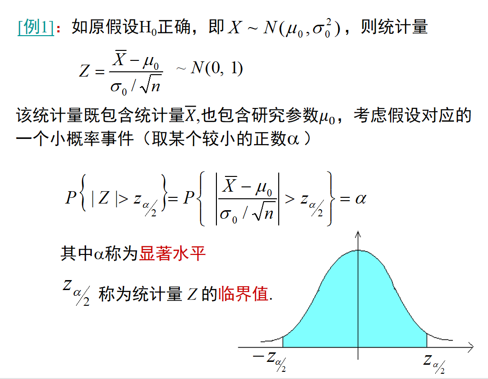
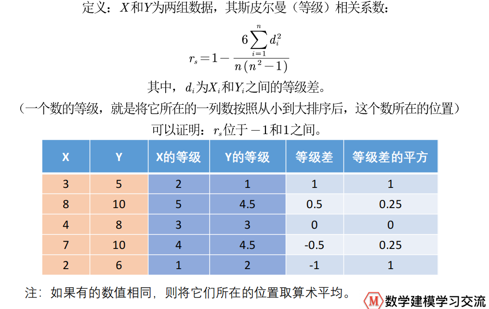

# 相关系数

## 皮尔逊相关系数

### 概念

若我们得到的是**总体**的数据，则计算公式如下：

$$
总体均值：E(X)=\frac{\sum_{i=1}^{n}X_{i}}{n},E(Y)=\frac{\sum_{i=1}^{n}Y_{i}}{n}
$$

$$
总体协方差：Cov(X,Y)=\frac{\sum_{i=1}^{n}(X_{i}-E(X))(Y_{i}-E(Y))}{n}=E\{[X-E(X)][Y-E(Y)]\}
$$

$$
总体Pearson相关系数：\rho_{xy}=\frac{Cov(X,Y)}{\sigma_{X}\sigma_{Y}}=\frac{\sum_{i=1}^{n}\frac{(X_{i}-E(X))}{\sigma_{X}}\frac{(Y_{i}-E(Y))}{\sigma_{Y}}}{{n}}
$$

$$
\sigma_{X}是X的标准差,\sigma_{X}=\sqrt{\frac{\sum_{i=1}^{n}(X_{i}-E(X))^{2}}{n}},\sigma_{Y}=\sqrt{\frac{\sum_{i=1}^{n}(Y_{i}-E(Y))^{2}}{n}}  
$$

可以将皮尔逊相关系数看成求X和Y标准化后的协方差。


若我们得到的是**样本**的数据（绝大多数情况均为样本），则计算公式如下：

$$
样本均值：\overline{X}=\frac{\sum_{i=1}^{n}X_{i}}{n},\overline{Y}=\frac{\sum_{i=1}^{n}Y_{i}}{n} \\
$$

$$
样本协方差：Cov(X,Y)=\frac{\sum_{i=1}^{n}(X_{i}-\overline{X})(Y_{i}-\overline{Y})}{\color{red}{n-1}} \\
$$

$$
样本Pearson相关系数：r_{xy}=\frac{Cov(X,Y)}{S_{X}S_{Y}} \\
$$

$$
S_{X}是X的样本标准差,S_{X}=\sqrt{\frac{\sum_{i=1}^{n}(X_{i}-\overline{X})^{2}}{\color{red}{n-1}}},S_{Y}=\sqrt{\frac{\sum_{i=1}^{n}(Y_{i}-\overline{Y})^{2}}{\color{red}{n-1}}}
$$

**注意**：在使用皮尔逊相关系数前，须确保X和Y是线性关系。皮尔逊相关系数只能检验X和Y之间的线性相关系数的大小，在不知道散点图的情况下，计算的相关系数接近于1不能说明X和Y是强线性关系。计算的相关系数接近于0只能说明X和Y不是线性关系，但可能有其他更为复杂的相关关系。


### 统计相关代码

```matlab
MIN = min(Test); % 每一列的最小值
MAX = max(Test); % 每一列的最大值
MEAN = mean(Test); % 每一列的均值
MEDIAN = median(Test); % 每一列的中位数
SKEWNESS = skewness(Test); % 每一列的偏度
KURTOSIS = kurtosis(Test); % 每一列的峰度
STD = std(Test); % 每一列的标准差
RESULT = [ MIN ; MAX ; MEAN ; MEDIAN ; SKEWNESS ; KURTOSIS ; STD ]; % 将这些统计量放到一个矩阵中展示
```


### Excel相关操作

以 Microsoft Office Home and Student 2019为例

首先需要调出数据-分析-数据分析

1、点击“文件”-“选项”-“加载项”

2、找到分析工具库，点击“转到”

3、勾选分析工具库，点击“确定”，完成设置

点击数据分析后

1、选择描述统计

2、选择输入区域，并勾选汇总统计，即可得到与上述代码一样的结果


### 皮尔逊相关系数代码

```matlab
R = corrcoef(Test) % 返回Test的相关系数矩阵，列表示随机变量(指标)，行表示观测值(样本)
```


### 美化相关系数矩阵

以 Microsoft Office Home and Student 2019 为例

1、在“开始”-“格式”中通过设置行高和列宽调整单元格大小

2、在对齐方式中设置两个居中

3、选择相关系数表，“开始”-“条件格式”-“色阶”-“红白蓝”

4、选中相关系数表，“开始”-“条件格式”-“管理规则”-“编辑规则”，修改颜色规则


## 假设检验

### 假设的设立

$$
通常称H_{0}假设为原假设，H_{1}假设为备择假设
$$

$$
检验的目的就是要在原假设H_{0}和备择假设H_{1}之间 
$$

$$
选择其一:
$$

$$
1) 若认为原假设H_{0}为正确的，则接受H_{0}
$$

$$
2) 若认为原假设H_{0}是不正确的，则拒绝H_{0}，而接受备择假设H_{1}
$$

### 小概率的实际不可能性原理

$$
1) 在承认原假设H_{0}正确的条件下，选取H_{0}正确下的小概率事件A\\
2) 由抽样的结果考察A是否出现\\
3) 如果H_{0}是正确的，那么A发生的概率是小的，一次抽样一般A不会出现。由此形成如下准则：\\
若A出现，则说明H_{0}不正确 \\
若A不出现，则认为H_{0}正确 \\
$$

### 例子




## 对皮尔逊相关系数进行假设检验

### 第一步

$$
提出原假设H_{0}和备择假设H_{1} \\
对计算出的皮尔逊相关系数r，我们想检验其是否显著的异于0 \\
则设定\;H_{0}:r=0,H_{1}:r\neq0
$$

### 第二步

$$
在原假设成立的条件下，利用我们要检验的量构造出一个符合某一分布的统计量 \\
对于皮尔逊相关系数r而言，在满足一定条件下，我们可以构造统计量 \\
t=r\sqrt{\frac{n-2}{1-r^{2}}}，可以证明t是服从自由度为n-2的t分布
$$

### 第三步

$$
将我们要检测的值代入这个统计量中 \\
选择一个显著水平\alpha \\
比较计算得到的t值和z_{\alpha/2}的大小，得出结论
$$


## p值检测法

我们不需要再给定显著水平，Matlab可以帮我们计算出小概率事件到底有多小

```matlab
[R,P] = corrcoef(Test); % R返回相关系数矩阵，P返回每个相关系数进行上述假设检验后的p值
% 下述代码的作用是在Excel表格中标出显著性符号
P < 0.01; % 返回一个与P大小相同的矩阵，P中的值小于0.01，则该矩阵对应位置的值为1，否则为0
% 标记3颗星的位置
(P < 0.5) .* (P > 0.01);
% 标记2颗星的位置
(P < 0.1) .* (P > 0.5);
% 标记1颗星的位置
```


### 假设检验条件

1、实验数据须保证为成对的来自正态分布的总体。

2、实验数据的差距不能太大。

3、每组样本之间是独立抽样的。


## 检验数据是否为正态分布

### 正态分布JB检测(样本n>30)

$$
对于一个随机变量\{X_{i}\}，假设其偏度为S，峰度为K，那么我们可以构建JB统计量：\\
JB=\frac{6}{n}[S^{2}+\frac{(K-3)^{2}}{4}] \\
可以证明，如果\{X_{i}\}是正态分布，那么在大样本情况下JB\sim\chi^{2}(2)(自由度为2的卡方分布) \\
注：正态分布的偏度为0，峰度为3 \\
那么可进行假设检验：\\
$$

```matlab
% Matlab中进行JB检验语法
[h,p] = jbtest(x, alpha); % x是待检验的随机变量，alpha是显著性水平，h为假设检验结果，若服从正态分布，则值为0，p与上述p值相同，有些多余

% 用循环检验所有列的数据
n_c = size(Test,2); % 得到数据的列数
H = zeros(1,6);
P = zeros(1,6);
for i = 1 : n_c
	[h,p] = jbtest(Test(:,i),0.05);
	H(i)=h;
	P(i)=p;
end
```

### Q-Q图

要利用Q-Q图鉴别样本数据是否近似分布于正态分布，只需要看Q-Q图上的点是否近似地在一条直线附近。(要求数据量非常大)

```matlab
qqplot(Test(:,1)) % 显示第一列是否在一条直线附近
```


## 皮尔逊相关系数总结

判定两组数据的相关性：

1、分别判定两组数据是否服从正态分布

2、计算相关系数

3、进行假设检验判断相关程度是否显著


## 斯皮尔曼相关系数

### 概念



```matlab
corr(X,Y,'type','Spearman') % 计算X和Y两组列向量的斯皮尔曼相关系数
corr(X,'type','Spearman') % 计算X矩阵各列之间的斯皮尔曼相关系数
```

### 假设检验

#### 小样本

小样本情况，即n < 30时，直接查临界值表即可。

只有当相关系数大于对应的临界值时，才能得出显著的结论

#### 大样本

$$
大样本情况下，统计量r_{s}\sqrt{n - 1}\sim N(0,1) \\
H_{0}:r_{s}=0,H_{1}:r_s\neq0

$$

```matlab
[R,P]=corr(Test,'type','Spearman'); % 与皮尔逊相关系数基本一致
```


## 两个相关系数的比较


