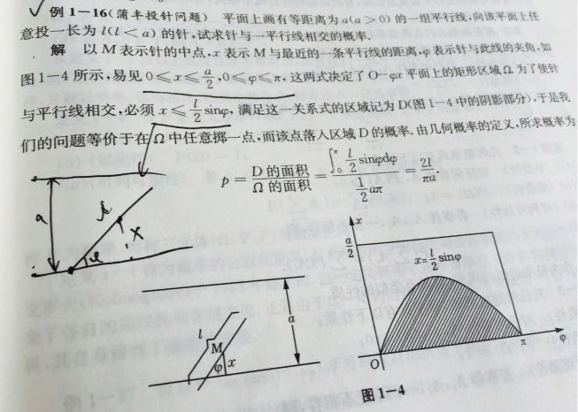

# 蒙特卡洛模拟

## 概述

### 定义

​	蒙特卡罗方法又称统计模拟法，是⼀种随机模拟⽅法，以概率和统计理论方法为基础的⼀种计算⽅法，是使用随机数（或更常见的伪随机数）来解决很多计算问题的方法。将所求解的问题同⼀定的概率模型相联系，用电子计算机实现统计模拟或抽样，以获得问题的近似解。为象征性地表明这⼀方法的概率统计特征，故借用赌城蒙特卡罗命名。

### 原理

​	由大数定理可知，当样本容量足够大时，事件的发生频率即为概率。

## 例子

### 1、布丰投针

#### 题目描述

在平面上画有一组间距为a的平行线，将一根长度为l (l < a) 的针任意投掷在这个平面上，求此针与平行线中任一条相交的概率。

$$
p=\frac{2l}{\pi a}(其中\pi 为圆周率)
$$



#### 代码

```matlab
%  rand(m,n)函数产生由在[0,1]之间均匀分布的随机数组成的m行n列的矩阵（或称为数组）
%  rand(n)函数产生由在[0,1]之间均匀分布的随机数组成的n行n列的矩阵(或称为数组)

%  完整代码
l =  0.520;     % 针的长度（任意给的）
a = 1.314;    % 平行线的宽度(大于针的长度l即可)
n = 1000000;    % 做n次投针试验，n越大求出来的pi越准确
m = 0;    % 记录针与平行线相交的次数
x = rand(1, n) * a / 2 ;   % 在[0, a/2]内服从均匀分布随机产生n个数， x中每一个元素表示针的中点和最近的一条平行线的距离
phi = rand(1, n) * pi;    % 在[0, pi]内服从均匀分布随机产生n个数，phi中的每一个元素表示针和最近的一条平行线的夹角
% axis([0,pi, 0,a/2]);   box on;  % 画一个坐标轴的框架，x轴位于0-pi，y轴位于0-a/2， 并打开图形的边框
for i=1:n  % 开始循环，依次看每根针是否和直线相交
    if x(i) <= l / 2 * sin(phi (i))     % 如果针和平行线相交
        m = m + 1;    % 那么m就要加1
%         plot(phi(i), x(i), 'r.')   % 模仿书上的那个图，横坐标为phi，纵坐标为x , 用红色的小点进行标记
%         hold on  % 在原来的图形上继续绘制
    end
end
p = m / n;    % 针和平行线相交出现的频率
mypi = (2 * l) / (a * p);  % 我们根据公式计算得到的pi
disp(['蒙特卡罗方法得到pi为：', num2str(mypi)])
```

### 2、三门问题

#### 题目描述

​	你参加了一档电视节目，节目组提供了ABC三扇门，主持人告诉你，其中一扇门后边有辆汽车，其它两扇门后是空的。

​	假如你选择了B门，这时，主持人打开了C门，让你看到C门后什么都没有，然后问你要不要改选A门？

#### 代码

```matlab
% randi([a,b],m,n)函数可在指定区间[a,b]内随机生成大小为m*n的整数矩阵

n = 100000;  % n代表蒙特卡罗模拟重复次数
a = 0;  % a表示不改变主意时能赢得汽车的次数
b = 0;  % b表示改变主意时能赢得汽车的次数
for i= 1 : n  % 开始模拟n次
    x = randi([1,3]);  % 随机生成一个1-3之间的整数x表示汽车出现在第x扇门后
    y = randi([1,3]);  % 随机生成一个1-3之间的整数y表示自己选的门
    % 下面分为两种情况讨论：x=y和x~=y
    if x == y   % 如果x和y相同，那么我们只有不改变主意时才能赢
        a = a + 1;
    else  % x ~= y ，如果x和y不同，那么我们只有改变主意时才能赢
        b = b + 1;
    end
end
disp(['蒙特卡罗方法得到的不改变主意时的获奖概率为：', num2str(a/n)]);
disp(['蒙特卡罗方法得到的改变主意时的获奖概率为：', num2str(b/n)]);
```

### 3、模拟排队问题

#### 题目描述

​	假设某银行工作时间只有一个服务窗口，工作人员只能逐个的接待顾客。当来的顾客较多时，一部分顾客就需要排队等待。

​	假设：1）顾客到来的间隔时间服从参数为0.1的指数分布；2）每个顾客的服务时间服从均值为10，方差为4的正态分布（单位为分钟，若服务时间小于1分钟，则按1分钟计算）；3）排队按先到先服务的规则，且不限制队伍的长度，每天工作时长为8小时。

​	试回答下面的问题：1）模拟一个工作日，在这个工作日共接待了多少客户，客户平均等待时间为多少？；2）模拟100个工作日，计算出平均每日接待客户的个数以及每日客户的平均等待时长。

#### 代码

```matlab
% normrnd(MU,SIGMA):生成一个服从正态分布(MU参数代表均值,SIGMA参数代表标准差,方差开根号是标准差)的随机数
% exprnd(M)表示生成一个均值为M的指数分布随机数(其对应的参数为1/M)

% x(i)表示第i-1个客户和第i个客户到达的间隔时间，服从参数为0.1的指数分布
% y(i)表示第i个客户的服务持续时间，服从均值为10方差为4(标准差为2)的正态分布 (若小于1则按1计算)
% c(i)表示第i个客户的到达时间，那么c(i) = c(i-1) + x(i)，初始值c0=0
% b(i)表示第i个客户开始服务的时间
% e(i)表示第i个客户结束服务的时间，初始值e0=0
% 第i个客户结束服务的时间 = 第i个客户开始服务的时间 + 第i个客户的服务持续时间
% 即：e(i) = b(i) + y(i）
% 第i个客户开始服务的时间取决于该客户的到达时间和上一个客户结束服务的时间
% 即：b(i) = max(c(i),e(i-1))，初始值b1=c1;
% 第i个客户等待的时间 = 第i个客户开始服务的时间 - 第i个客户到达银行的时间
% 即：wait(i) = b(i) - c(i)
% w表示所有客户等待时间的总和
% 假设一天内银行最终服务了n个顾客，那么客户的平均等待时间t = w/n

day = 100;  % 假设模拟100天
n = zeros(day,1); % 初始化用来保存每日接待客户数结果的矩阵
t = zeros(day,1); % 初始化用来保存每日客户平均等待时长的矩阵
for k = 1:day
    i = 1;  % i表示第i个客户，最开始取i=1
    w = 0;  % w用来表示所有客户等待的总时间，初始化为0
    e0 = 0;  c0 = 0;   % 初始化e0和c0为0
    x(1) = exprnd(10);  % 第0个客户(假想的)和第1个客户到达的时间间隔
    c(1) = c0 + x(1);  % 第1个客户到达的时间
    b(1) = c(1); % 第1个客户的开始服务的时间
    while b(i) <= 480  % 开始设置循环，只要第i个顾客开始服务的时间(时刻)小于480，就可以对其服务（银行每天工作8小时，折换为分钟就是480分钟）
        y(i) = normrnd(10,2); % 第i个客户的服务持续时间，服从均值为10方差为4(标准差为2)的正态分布
        if y(i) < 1  % 根据题目的意思：若服务持续时间不足一分钟，则按照一分钟计算
            y(i) = 1;
        end
        e(i) = b(i) + y(i); % 第i个客户结束服务的时间 = 第i个客户开始服务的时间 + 第i个客户的服务持续时间
        wait(i) = b(i) - c(i); % 第i个客户等待的时间 = 第i个客户开始服务的时间 - 第i个客户到达银行的时间
        w = w + wait(i); % 更新所有客户等待的总时间
        i = i + 1; % 增加一名新的客户
        x(i) = exprnd(10); % 这位新客户和上一个客户到达的时间间隔
        c(i) = c(i-1) + x(i); % 这位新客户到达银行的时间 = 上一个客户到达银行的时间 + 这位新客户和上一个客户到达的时间间隔
        b(i) = max(c(i),e(i-1)); % 这个新客户开始服务的时间取决于其到达时间和上一个客户结束服务的时间
    end
    n(k) = i-1; % n(k)表示银行第k天服务的客户人数
    t(k) = w/n(k); % t(k)表示该银行第k天客户的平均等待时间
end
disp([num2str(day),'个工作日中，银行每日平均服务的客户人数为: ',num2str(mean(n))])
disp([num2str(day),'个工作日中，银行每日客户的平均等待时间为: ',num2str(mean(t))])
```

### 4、有约束的非线性规划问题

#### 题目描述

$$
\begin{equation}  
\left\{  
             \begin{array}{**lr**}  
             min\;\;f(x)\;\;目标函数 &  \\  
             s.t.\;\;g(x)\leq0\;\;不等式约束 &  \\  
             \;\;\;\;\;\;\;\;h(x)\;\;等式约束 &    
             \end{array}  
\right.  
\end{equation}

$$

$$
1、若f(x),g(x),h(x)为线性函数，即为线性规划(LP); \\
$$

$$
2、若f(x),g(x),h(x)至少一个为非线性，即为非线性规划(NLP); \\
$$

$$
3、对于非线性规划，若没有g(x),h(x)，称为无约束非线性规划; \\
$$

$$
否则称为约束非线性规划
$$

#### 代码

```matlab
% 代码要求解的有约束的非线性规划
% max f(x) = x1*x2*x3
% s.t.
% (1) -x1+2*x2+2*x3>=0
% (2) x1+2*x2+2*x3<=72
% (3) x2<=20 & x2>=10
% (4) x1-x2 == 10

% format long g  可以将Matlab的计算结果显示为一般的长数字格式（默认会保留四位小数，或使用科学计数法）
% unifrnd(a,b,m,n)可以输出在[a,b]之间均匀分布的随机数组成的m行n列的矩阵。(等价于 a + rand(m,n)*(b-a))

n=10000000; %生成的随机数组数
x1=unifrnd(20,30,n,1);  % 生成在[20,30]之间均匀分布的随机数组成的n行1列的向量构成x1
x2=x1 - 10;
x3=unifrnd(-10,16,n,1);  % 生成在[-10,16]之间均匀分布的随机数组成的n行1列的向量构成x3
fmax=-inf; % 初始化函数f的最大值为负无穷（后续只要找到一个比它大的我们就对其更新）
for i=1:n
    x = [x1(i), x2(i), x3(i)];  %构造x向量, 这里千万别写成了：x =[x1, x2, x3]
    if (-x(1)+2*x(2)+2*x(3)>=0)  &  (x(1)+2*x(2)+2*x(3)<=72)     % 判断是否满足条件
        result = x(1)*x(2)*x(3);  % 如果满足条件就计算函数值
        if  result  > fmax  % 如果这个函数值大于我们之前计算出来的最大值
            fmax = result;  % 那么就更新这个函数值为新的最大值
            X = x;  % 并且将此时的x1 x2 x3保存到一个变量中
        end
    end
end
disp(strcat('蒙特卡罗模拟得到的最大值为',num2str(fmax)))
disp('最大值处x1 x2 x3的取值为：')
disp(X)
```

## 总结


